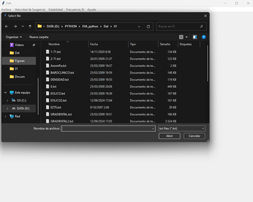
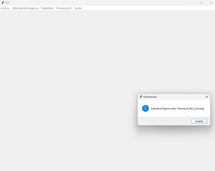

# EVA
## Estructura Vertical de las Aguas

### Vista del menú principal del programa EVA:

  </img>

### File – Menú para abrir el archivo de datos iniciales:

  </img>

### Mensaje informativo, que archivo hay que abrir:

  </img>

### se abra el explorador de Windows, donde se puede seleccionar el archivo con los datos iniciales (como ejemplo: “1-71.txt”):
 

  </img>

### Al seleccionar el archivo en formato “txt”, se muestran las características de los datos iniciales. Hay que escribir los límites de las longitudes y latitudes, el paso entre latitudes y longitudes, después oprimir el botón de “Continuar”: 
 

  </img>

### Siguiente menú, es para el calculo de la velocidad de surgencia:
 

  </img>

### La primera componente es la componente Eólica, donde después de abrir aparece el método de interpolación, para la presión atmosférica:
 

  </img>

### Características para la interpolación de la presión atmosférica:
 

  </img>

### Aviso para guardar el archivo de la figura del campo de la presión atmosférica:
 

  </img>

### Resultado de la interpolación de la presión atmosférica:
 

  </img>

### La segunda componente es la componente Gradiental, donde después de abrir aparece el método de interpolación, para la presión atmosférica:

  </img>

 

  </img>

 

  </img>

### La tercera componente es la componente Baroclinico, donde después de abrir aparece el método de interpolación, para la presión atmosférica:
  

  </img>

### Se guardan los resultados de densidades para cada profundidad:
  

  </img>

### Se realiza la interpolación de la densidad para cada profundidad:
 

  </img>

### Se guardan los resultados de interpolación para cada profundidad:
 

  </img>

### Elegir el método de interpolación superficial, para la densidad:
   

  </img>

### Características para la interpolación de la presión atmosférica:
 

  </img>

### Guardar la figura de la densidad en la superficie:
 

  </img>

### Resultado de la interpolación de la densidad de la superficie:
 
### Se guardan los resultados de la componente Baroclinico:

### Calculo de la velocidad de surgencias:
 

  </img>

### Se guardan los resultados de la velocidad de surgencias:
 

  </img>

### Elegir el método de interpolación superficial, para la de la velocidad de surgencias:

  </img>

### Características para la interpolación de la velocidad de surgencias:
 

  </img>

### Guardar la figura:

  </img>

### Resultado de la interpolación de la velocidad de surgencias:

  </img>

### Menú del cálculo de la Estabilidad:
 

  </img>

### Se guardan los resultados de los gradientes de T y S:
 

  </img>

### Se guardan los resultados de la estabilidad termohalina:

  </img>

### Graficar el perfil de la estabilidad en un punto:
 

  </img>

### Hay que abrir el archivo de estabilidad:
 

  </img>

### Hay que ingresar los valores de longitud y latitud del punto y la profundidad:
 

  </img>

### Ingresar el nombre del archivo para guardar la figura:
 

  </img>

### Ingresar los títulos para la figura:
 

  </img>

### El resultado del perfil:
 

  </img>

### Hacer un gráfico del transepto latitudinal:
 

  </img>

### Elegir el método de interpolación:
 

  </img>

### Características de la interpolación:
 

  </img>

### Guardar la figura:
 

  </img>

### Resultado del transepto latitudinal:
 

  </img>

### Hacer un gráfico del transepto logitudinal:
 

  </img>

### Elegir el método de interpolación:
 

  </img>

### Características de la interpolación:

  </img>

### Guardar la figura:
 

  </img>

### Resultado del transepto logitudinal:

  </img>

### Menú del cálculo de la Frecuencia N:
 

  </img>

### Se guardan los resultados de la velocidad del sonido:
 

  </img>

### Se guardan los resultados de Vaisala Brenta:
 

  </img>

### Graficar el perfil de la Vaisala Brenta en un punto:
 

  </img>

### Hay que abrir el archivo de Vaisala Brenta:
 

  </img>

### Hay que ingresar los valores de longitud y latitud del punto y la profundidad:
  

  </img>

### Ingresar el nombre del archivo para guardar la figura:
  

  </img>

### Ingresar los títulos para la figura:
  

  </img>

### El resultado del perfil:
  

  </img>

### Hacer un gráfico del transepto latitudinal:
  

  </img>

### Elegir el método de interpolación:
  

  </img>

### Características de la interpolación:
  

  </img>

### Guardar la figura:
  

  </img>

### Resultado del transepto latitudinal:
  

  </img>

### Hacer un gráfico del transepto logitudinal:
  

  </img>

### Elegir el método de interpolación:
   

  </img>

### Características de la interpolación:
   

  </img>

### Guardar la figura:
   

  </img>

### Resultado del transepto logitudinal:
   

  </img>

### Exit
Сierra y sale el programa:

### Help – Ayuda:
Se direcciona a la página de GitHub https://github.com/glignan/EVA/blob/main/README.md donde se muestra la ayuda con el presente programa:

### Help – Acerca de:
   

  </img>

### las Diferencias en Kriging con Python
### Introducción
La interpolación de Kriging es una técnica geoestadística ampliamente utilizada para estimar valores desconocidos de una variable en ubicaciones específicas basadas en valores conocidos en puntos de muestreo cercanos. En Python, existen múltiples bibliotecas que implementan Kriging, siendo PyKrige una de las más populares.
Diferencias entre los enfoques
Método 1:
Python
cov_model = Gaussian(dim=1, len_scale=len_scl, anis=0.2, angles=0.5, var=0.5, nugget=0.1)
OK1 = OrdinaryKriging(lonn,latt, datt, cov_model)
z1, ss1 = OK1.execute('grid', Xnew,Ynew)
Используйте код с осторожностью.
•	Modelo de Covarianza explícito: Define directamente un modelo de covarianza Gaussiano con parámetros específicos (dimensión, escala de longitud, anisotropía, ángulos, varianza y nugget).
•	Control total sobre parámetros: Permite un ajuste fino del modelo de covarianza según el conocimiento del fenómeno.
•	Potencialmente más complejo: Requiere un conocimiento profundo de los parámetros del modelo de covarianza.
Método 2:
Python
OK1 = OrdinaryKriging(lonn, latt, datt,
                      variogram_model=variog_mod)  # linear, power, gaussian, spherical, exponential, hole-effect
z1, ss1 = OK1.execute('grid', Xnew, Ynew)
Используйте код с осторожностью.
•	Modelo de Variograma: Especifica el tipo de variograma (lineal, potencia, gaussiano, esférico, exponencial, efecto agujero) a utilizar.
•	Estimación de parámetros: Los parámetros del variograma (rango, sill, nugget) se estiman automáticamente a partir de los datos.
•	Simplicidad: Es más fácil de implementar y requiere menos conocimiento previo sobre el modelo de covarianza.
Cuándo usar cada enfoque
•	Método 1: 
o	Cuando se tiene un conocimiento profundo del fenómeno y se pueden especificar los parámetros del modelo de covarianza con precisión.
o	Cuando se requiere un control total sobre el proceso de interpolación.
•	Método 2: 
o	Cuando no se tiene información previa sobre el comportamiento espacial de los datos.
o	Cuando se busca una solución rápida y sencilla.
Consideraciones adicionales
•	Ambos enfoques pueden producir resultados similares, pero la elección del modelo y la estimación de parámetros pueden influir en la precisión de la interpolación.
•	Es recomendable explorar diferentes modelos de covarianza o variograma y comparar los resultados para seleccionar el mejor ajuste.
•	La validación cruzada puede ser útil para evaluar la calidad de la interpolación.
En resumen, la elección entre estos dos enfoques depende del nivel de conocimiento sobre los datos y el objetivo de la interpolación. Ambos métodos tienen sus ventajas y desventajas, y la selección adecuada puede mejorar la precisión y eficiencia del proceso de Kriging.

